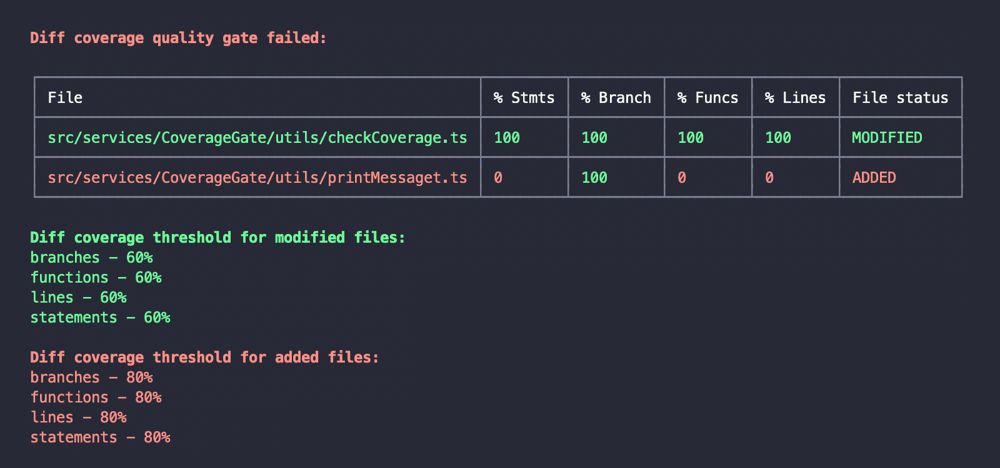

# Jest Coverage Gate

[](https://www.npmjs.com/package/jest-coverage-gate)

Checking the coverage of changed and added files


<br  />

## Features

- Separate `coverage threshold` settings for new and changed files
- Ability to specify `target` branch relative to which `diff` will be calculated

## Usage

1. Install:

```shell
npm i jest-coverage-gate -D
```

2. Add `jest-coverage-gate` to the `coverageReporters` list of your Jest configuration:

```js
{
  coverageReporters: [
    "clover", "json", "lcov", "text", // default
    [
      'jest-coverage-gate',
      {
        since: 'develop', // origin/develop, OR origin/develop...HEAD, OR commitHash...commitHash
        modified: {
          branches: 50,
          functions: 50,
          lines: 50,
          statements: 50,
        },
        added: {
          branches: 80,
          functions: 80,
          lines: 80,
          statements: 80,
        },
      },
    ],
  ],
}
```

3. Run Jest:

```shell
jest --coverage
```
